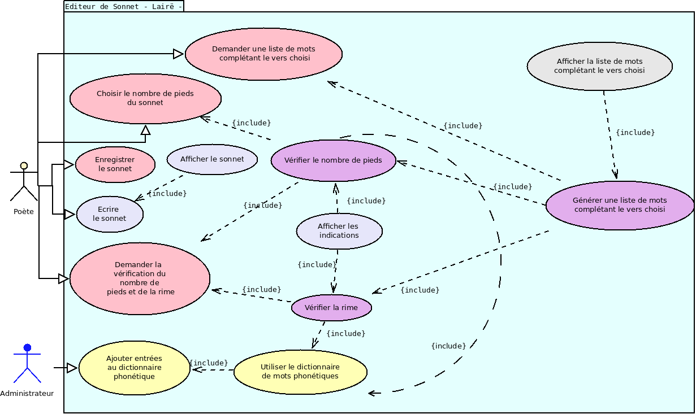
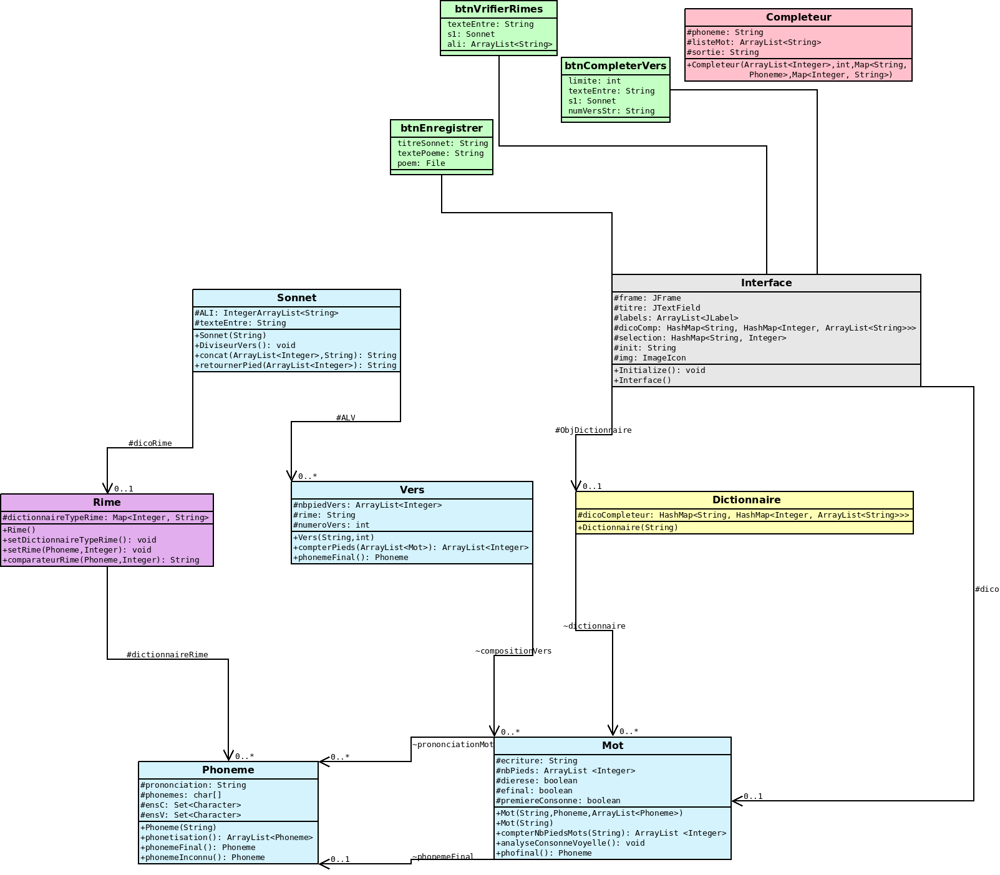
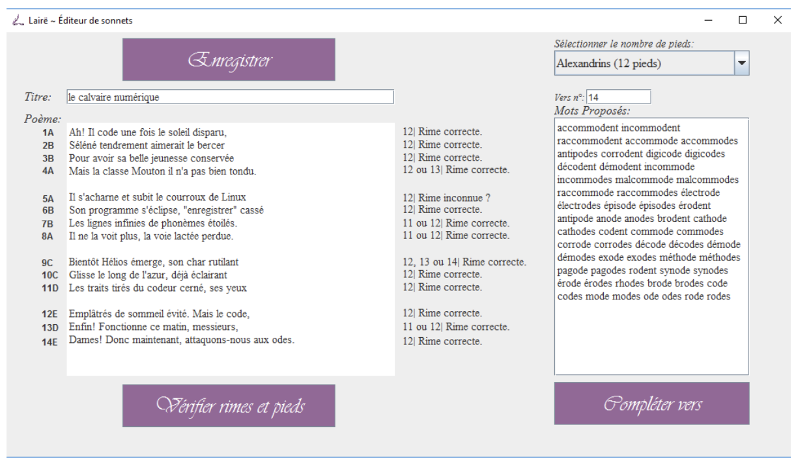

    

# Lairë - Sonnet Editor
Implementation of a program including a user interface to help edit poetic sonnet.

This project was done as part of the course Info II (
data structure and object-oriented programming).

## Presentation of the project

https://prezi.com/c9xbs-jjyxqb/laire/

## Usecase

    

## Class diagram

    

## Interfaces

    

